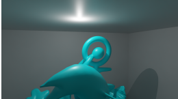
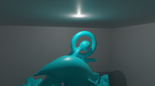
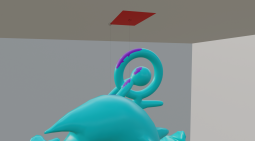
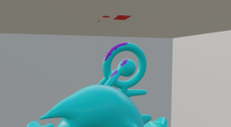
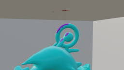
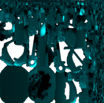

The Declarative Modelling algorithm is based on the approach found in "Inverse Direct Lighting with a Monte Carlo Method and Declarative Modelling" from Jolivet V., Plemenos D., and Poulingeas P. [1]

Normally, Declarative Modelling describes a user verbally articulating what they wish the scene to look like. The "wish" would normally be to say "I want these parts
of the object to be illuminated" and, in accordance to that, a light source would be placed. But since it's the very light source we are looking for, we can reverse this
wish now, meaning that we extract the parts of the object that are lighted the most. From these marked parts of the mesh, rays will be fired, hitting patches on the
wrapper object. Depending on the number of times specific patches have been hit, the light source position will be estimated.

Here is the algorithm implemented for Blender:

1. bake the illuminated texture of the scene object and save it
2. calculate intensities of each pixel and declare their mean value as the intensity of the patch -> do it for every patch
3. go through all the patches again -> check which ones are "illuminated" through a selected percent threshold
4. for every selected patch:
       as long as the number of new patch hits on the wrapper object is not under 20%
           fire 100 rays from the center of selected patch
           save which patches of the wrapper object were hit and how many times each
           extract the patches that were hit for the first time (new patches)
5. now we have a list of the selected patches of the scene object and their assigned hits of all their individual patch hits on the wrapper object
6. take every patch of the wrapper object and calculate its form factor with the current patch of the scene object
       form factor = number of times the wrapper object patch was hit/sum of all fired rays of the current patch of the scene object 
7. filter out relevant patches of the wrapper object
      -> only select patches which were hit by every single selected patch of the scene object at least once
      -> delete patches which have at least one form factor < 1/number of hit patches of the current selected patch of the scene object
      if no patch is left -> only do the first filter
8. calculate the center position of the wrapper object patches that are left -> reconstructed light source position

The algorithm can be tested using the instructions on the Wiki.

[1] Jolivet V., Plemenos D., Poulingeas P.: "Inverse Direct Lighting with a Monte Carlo Method and Declarative Modelling.", Sloot, P.M.A., Hoekstra, A.G., Tan, C.J.K., Dongarra, J.J. (eds) Computational Science — ICCS 2002. Lecture Notes in Computer Science, Springer Berlin Heidelberg, Vol. 2330, pp. 3-12, 2002