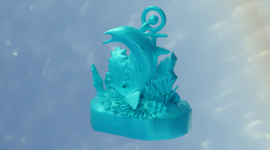
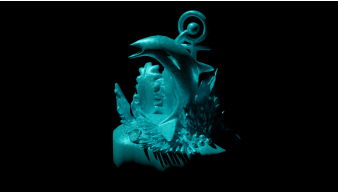
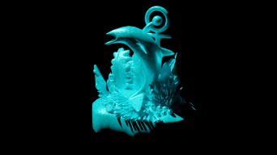

The Path Tracing algorithm is based on the approach found in "Light source estimation with Analytical Path-Tracing" from Kasper M., Keivan N., Sibley G., and Heckman C. [1]

The idea of Path Tracing is to trace rays from the light source all the way to the camera. The rays are reflected on the surface of the scene object which can be used to
do the same procedure in reverse. Meaning, we trace a fraction of all the rays from the camera, through the reflections on the scene object, to the light source.
The light source is situated on a sphere object wrapping the entire scene, you can call it an Environment Map.

Here is the algorithm implemented for Blender:

1. several thousand rays fired from the camera - bound to the field of view
2. rays are drawn until they collide with a surface
   if surface == scene object -> generate random reflect direction and fire new ray from collision point (lambertian reflection)
   if surface == Environment Map -> extract light source direction (collision point - world center), color, position
3. after all rays have been traced -> check which ray has the brightest color (multiply rgb) -> recovered light source with position, direction, color

The algorithm can be tested following the instructions on the Wiki.

[1] Kasper M., Keivan N., Sibley G., Heckman C.: "Light Source Estimation with Analytical Path-tracing.", arXiv preprint arXiv:1701.04101, 2017